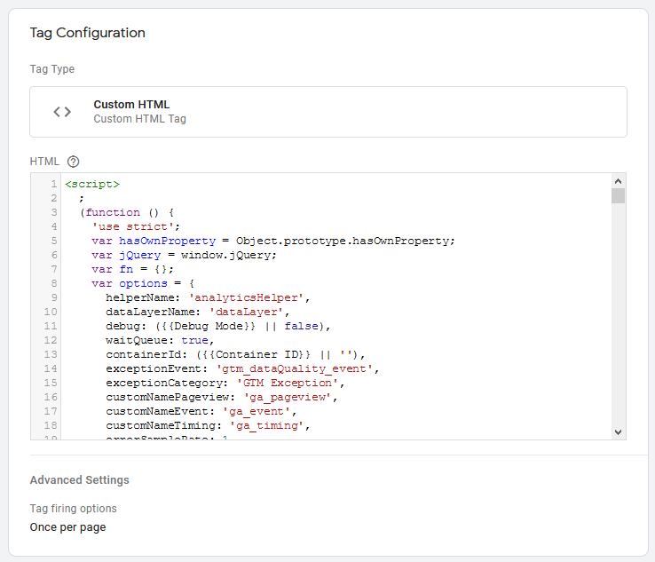
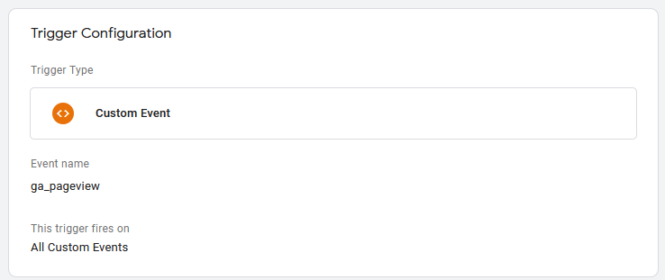
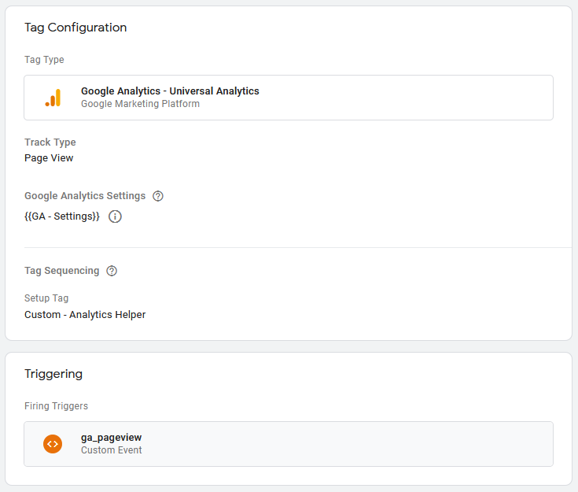
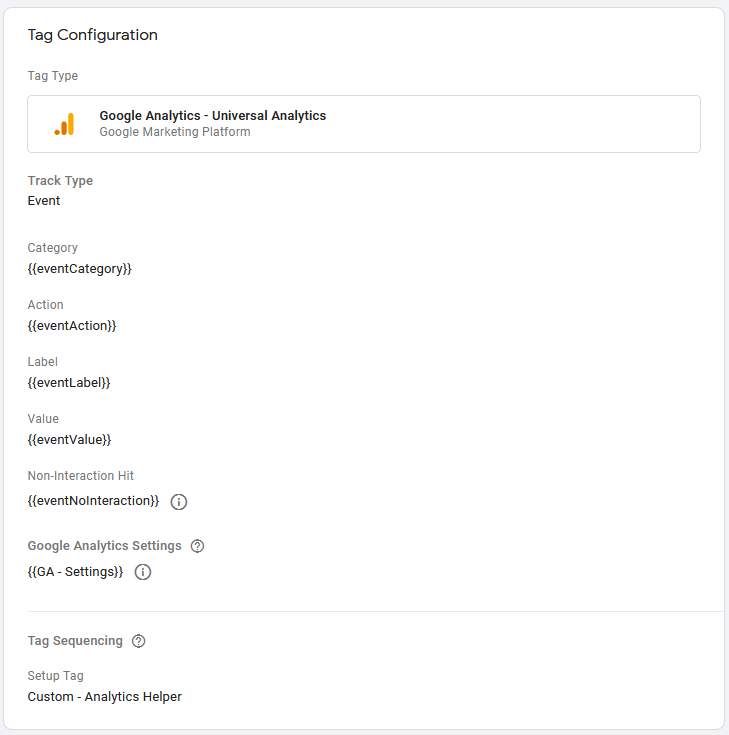
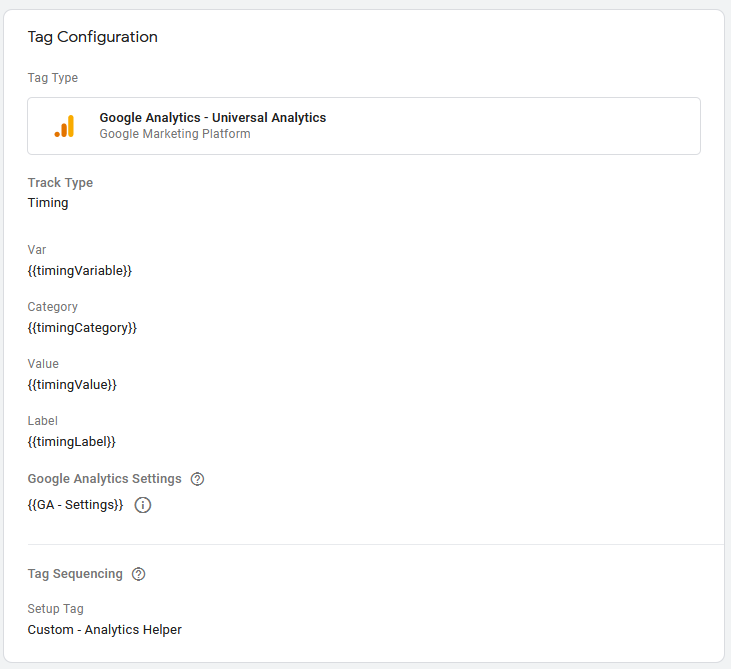
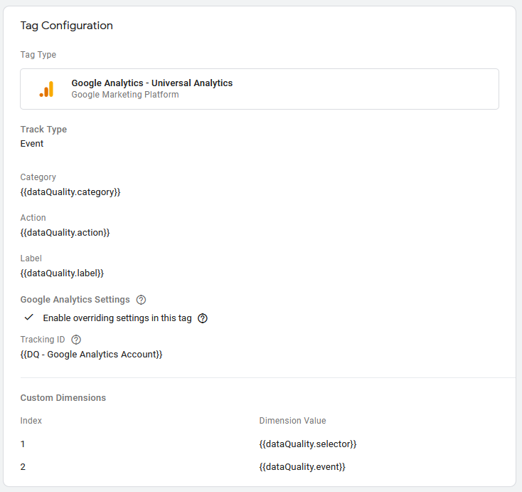
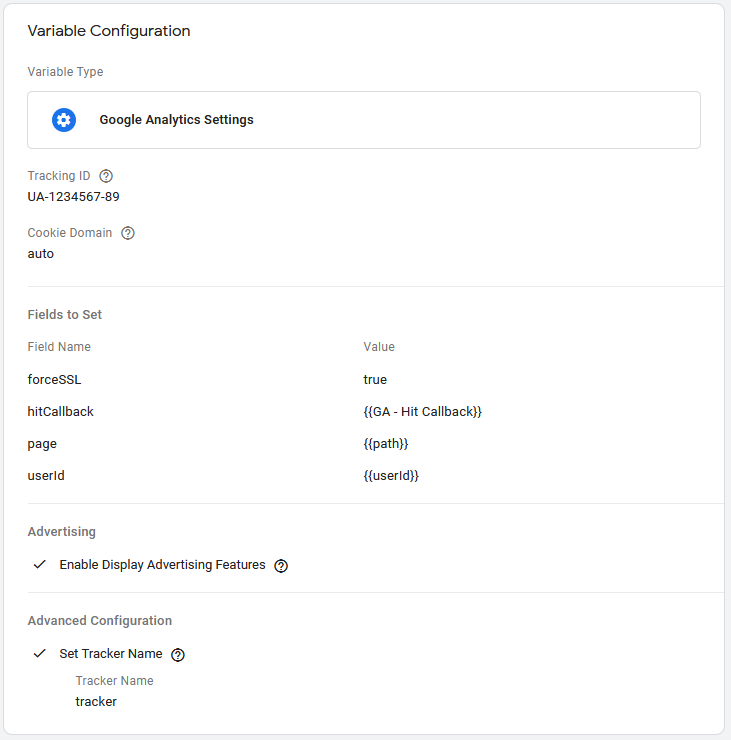

# Configuração do GTM

Este documento descreve os passos para a utilização da biblioteca analytics-helper em conjunto com o Google Tag Manager, e as configurações necessárias.

## Tag principal

O arquivo final, presente na pasta _build_, seja ele o arquivo de exemplo disponível neste repositório, ou uma versão personalizada gerada via Gulp, deverá ser copiado integralmente para uma Tag Custom HTML.

Em configurações avançadas, a opção de executar uma única vez por página deverá ser selecionada.



As tags que utilizarem o objeto analyticsHelper devem configurar esta tag principal como requisito na seção _sequência de tags_, para garantir que o objeto estará definido antes do uso.

## Acionadores

Quatro acionadores do tipo _evento personalizado_ devem ser criados.

Os nomes dos eventos serão os mesmos nomes utilizados para identificá-los na camada de dados: _gtm_dataQuality_event_, _ga_pageview_, _ga_event_ e _ga_timing_.



## Tags de template

Quatro tags de Universal Analytics devem ser criadas, uma para cada acionador criado acima.

Estas tags devem ser preenchidas com as variáveis de camada de dados listadas na próxima seção. Estes são os campos padrões, as tags podem ser modificadas para incluir ou remover dimensões personalizadas, dados de ecommerce e outras configurações.

### Template de Pageview (+ GA Settings)



### Template de Evento (+ GA Settings)



### Template de Timing (+ GA Settings)



### Template de Data Quality



### Template de GA Settings



## Variáveis

As variáveis padrão _Container ID_ e _Debug Mode_ devem ser habilitadas, pois elas são utilizadas pelo código da _tag principal_.

A tabela a seguir descreve todas as variáveis do tipo _variável de camada de dados_ que deverão ser criadas para o uso nas tags de template do Google Analytics:

| Nome da variável de Camada de Dados | Tag que utiliza     | Campo do template             |
| ----------------------------------- | ------------------- | ----------------------------- |
| eventCategory                       | Tag de Evento       | Categoria                     |
| eventAction                         | Tag de Evento       | Ação                          |
| eventLabel                          | Tag de Evento       | Rótulo                        |
| eventValue                          | Tag de Evento       | Valor                         |
| eventNoInteraction                  | Tag de Evento       | Hit de não-interação          |
| timingCategory                      | Tag de Evento       | Categoria                     |
| timingVariable                      | Tag de Evento       | Variável                      |
| timingValue                         | Tag de Evento       | Valor                         |
| timingLabel                         | Tag de Evento       | Rótulo                        |
| path                                | GA Settings         | Fields to Set -> page         |
| userId                              | GA Settings         | Fields to Set -> userId       |
| dataQuality.category                | Tag de Data Quality | Categoria                     |
| dataQuality.action                  | Tag de Data Quality | Ação                          |
| dataQuality.label                   | Tag de Data Quality | Rótulo                        |
| dataQuality.selector                | Tag de Data Quality | Dimensões Personalizadas -> 1 |
| dataQuality.event                   | Tag de Data Quality | Dimensões Personalizadas -> 2 |

Caso utilize a opção waitQueue (habilitada por padrão), a seguinte variável de _javascript personalizado_ deverá ser criada e adicionada ao campo _hitCallback_ em _Fields to Set_ nas tags de template de Google Analytics.

```javascript
function () {
  return function () {
    analyticsHelper.internal.sentPageview = true;
    while (analyticsHelper.internal.eventQueue.length) {
      analyticsHelper.event.apply(analyticsHelper, analyticsHelper.internal.eventQueue.shift());
    }
    while (analyticsHelper.internal.timingQueue.length) {
      analyticsHelper.timing.apply(analyticsHelper, analyticsHelper.internal.timingQueue.shift());
    }
  };
}
```
